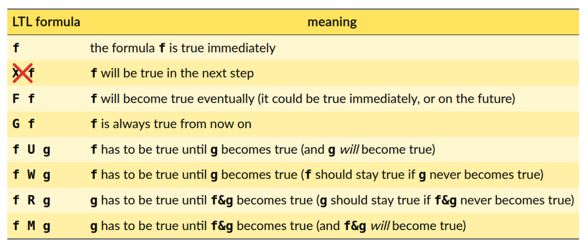

## Discretizzazione di una formula RTLf
Una formula RTLf deve subire una serie di trasformazioni tra cui:
- **Discretizzazione secondo le regole del paper**: la formula RTLf viene discretizzata, trasformandola in una formula LTLf;
- **Trasformazione in una formula LTL**: La formula LTLf ottenuta viene successivamente trasformata in una formula LTL.

Presumibilmente, queste trasformazioni possono essere eseguite visitando l'albero della formula (utilizzando Spot) solo una volta, riducendo così il numero di passaggi necessari.

Le trasformazioni specifiche per ogni caso sono contenute in questa directory.

### Operatore strict until
L'operatore strict until non è supportato da Spot in quanto una libreria per omega-automaton.

Tuttavia, sbirciando il codice sorgente di Spot, non è stato difficile introdurre un nuovo operatore (`S`, **S**trict until)
che viene riconosciuto come un operatore LTL dal parser di Spot. Dopo le trasformazioni, questo operatore non sarà più presente nella formula, quindi non causerà alcun problema nelle fasi successive.